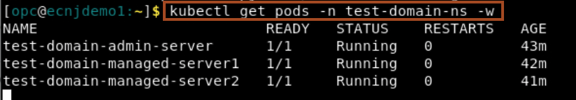

# Simulate Auto scaling up and down

## Introduction

In this lab, we will demonstrate how to scale a WebLogic cluster, based on WebLogic metrics provided by the Monitoring Exporter, using the Kubernetes Horizontal Pod Autoscaler (HPA). 

Estimated Time: 20 minutes

### Objectives

In this lab, you will:

* Enable Kubernetes Horizontal Pod Autoscaler
* Observe the replica status
* Create HTTP request to Opdemo Application
* Observe Scaling out of WLS Cluster
* Explore Grafana console
* Observe Scaling in of WLS cluster
* Disable Kubernetes Horizontal Pod Autoscaler

### Prerequisites

* Access to noVNC Remote Desktop.

## Task 1: Enable Kubernetes Horizontal Pod Autoscaler

1. In the terminal, go to the terminal named **HPA-Pods**. Copy and paste the commands below to enable the Kubernetes Horizontal Pod Autoscaler. This configures **HPA** to scale out the WebLogic cluster when the average current session count exceeds 5 per managed server pod.
    ```bash
    <copy>kubectl apply -f customhpa.yaml</copy>
    ```

## Task 2: Observe the replica status

1. lets verify the HPA configuration by copy and paste the following command in the **HPA-Pods** tab in the terminal.
    ```bash
    <copy>kubectl get hpa -n test-domain-ns -w</copy>
    ```
    


2. In the **Server Pods** tab in the terminal, copy and paste the following commond to view the server pods in WebLogic domain  **test-domain**. 
    ```bash
    <copy>kubectl get pods -n test-domain-ns -w</copy>
    ```

    
    > As we have configure minimum replica **2**, so we have 2 managed server pods are running.

## Task 3: Create HTTP request to Opdemo Application

1. Now we are going to increase the application current session count to 20. Which will be equally shared by both the managed server pods. So on average we will have current session count as 10 per managed server pods. In the browser, click **refresh** button 20 times to access the **opdemo** application 20 times. 
    

2. In the Firefox, in the new tab, open the second bookmark **Prometheus** as shown. Click **Graph** to view graph view.
    
    

2. Go to Prometheus tab in the browser and click **Execute** to get the opdemo current session.
    


3. Go to **HPA-Pods** tab in the terminal and view it status. You can view, as it target met, so it increase the replicas from **2** to **3**.
    


## Task 4: Observe Scaling out of WLS Cluster


1. Go to **Server Pods** tab in the terminal and observe **managed-server3** is in **Running** state.
    

2. In the browser, click **refresh** icon to access the application again. Now the application will be served by **managed-server3**
    


## Task 5: Explore Grafana console

1. In the Firefox, in the new tab, open the third bookmark **Grafana** as shown.
    

2. Enter the saved **admin** credential, and click **Log in**.
    

3. View the Grafana dashboard for the WebLogic domain. Ensure to change **Local browser time** to **5** minutes as shown.
    


## Task 6: Observe Scaling in of WLS cluster


1. Now access the Prometheus tab in the browser to check the **opdemo** current session count.
    

2. Go to **HPA-Pods** tab in the terminal, as the application average session count is less the 5 per managed server pods. **HPA** change the replica from **3** to **2**.
    

3. Go to **Server Pods** tab in the terminal and observe **managed-server3** is in **terminating** state.
    


## Task 7: Disable Kubernetes Horizontal Pod Autoscaler

1. In the terminal, go to the terminal named **HPA-Pods**. Copy and paste the commands below to disable the Kubernetes Horizontal Pod Autoscaler. 
    ```bash
    <copy>kubectl delete -f customhpa.yaml</copy>
    ```


## Acknowledgements

* **Author** -  Ankit Pandey
* **Contributors** - Sid Joshi, Maciej Gruszka 
* **Last Updated By/Date** - Ankit Pandey, September 2024