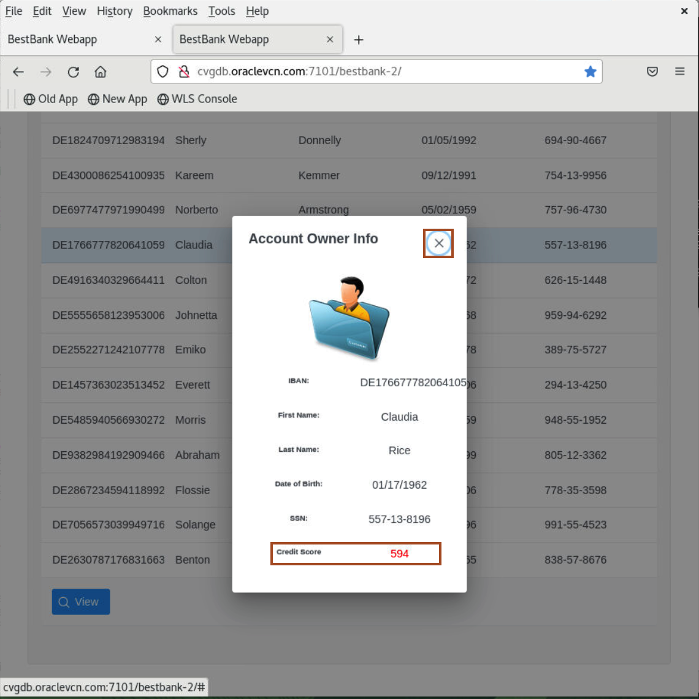

# Modernise with WebLogic, Helidon and Coherence 

## Introduction

The very purpose of writing microservices is to do a small piece of job efficiently and re-use it multiple times in different applications. Helidon MP enables us to write one such microservice for this demo. **BestBank**, a hypothetical bank has an application. As part of that application, the bank’s credit division wants to build a simple UI which showcases the details of top 15 customers with their SSN number and IBAN number. The team wants to have a microservice which provides credit score of the customer as output taking the user details like IBAN/SSN numbers as input. The IT developers create a CreditScore Microservice in Helidon and consume it in the current UI application listing the top 15 customers.

### Implementation Details and Assumptions

* The sample application UI is built to showcase JSF and CDI using XHTML
* The user data is not coming from database
* The Helidon Microservice written in the lab can be deployed on Docker/Kubernetes, but for this demo, we only run it from the JVM locally

Estimated Time: 10 minutes

Watch the video below for a quick walk-through of the lab.
[Upgrade WebLogic Server Version](videohub:1_5vonezmn)

### Objectives

In this lab, you will:

* Verify Basic Bank Application working
* Show Modernise Best Bank application working
* Clean up

### Prerequisites

* Access to noVNC Remote Desktop created in lab 1.

## Task 1: Verify Basic Best Bank Application working

1. In the firefox, open a new tab and click first bookmark **Old App**.
    

2. This is a traditional application Best Bank application running on WebLogic Server.

## Task 2: Show Modernise Best Bank application working

This is extended version of application, where we have created a CreditScore Microservice in **Helidon MP**. We are also using **Coherence Cache** for storing customer credit score. So for any customer, when you click **View** button first time, our code generates random credit score and store it in the  Coherence Cache. Now, when you again click **View** button for the same customer, It provide the credit score from coherence cache.

1. In the firefox, open a new tab and click second bookmark **New App**.
    

2. Go back to terminal and Open the **Helidon-Server** named tab and Press **enter** multiple times, so you can easily see new log lines.
    

3. Now select any bank customer and click **View**. You will see the **Account Owner Info** window with Customer details. Click **Cross** icon to close it.
    
    

4. Go back to terminal and Open the **Helidon-Server** named tab and view the invocation of Helidon Application. As we are accessing the details for this customer first time, Helidon application generates the credit score.
    

    > Press **enter** multiple times, so you can easily see new log lines. 

5. Go back to browser and again select the same customer and click **View** button. You can see, it is the same credit score, which we seen last time as well. Click **Cross** icon to close this.  Now Go back to **Helidon Server** tab in the terminal, you can see the logs, **Credit score from cache**.
    
    
    

    > Press **enter** multiple times, so you can easily see new log lines.

## Task 3: Clean up

1. Close the tab, where you have the **New App** (bestbank-2) is running.

## Acknowledgements

* **Author** -  Ankit Pandey
* **Contributors** - Sid Joshi, Maciej Gruszka 
* **Last Updated By/Date** - Ankit Pandey, September 2024