# Scaling a WebLogic Cluster using WebLogic Kubernetes Toolkit UI

## Introduction

We have deployed the WebLogic **opdemo** application. In this lab, we will access the application and explore WebLogic Kubernetes Toolkit UI and WebLogic Remote Console.
 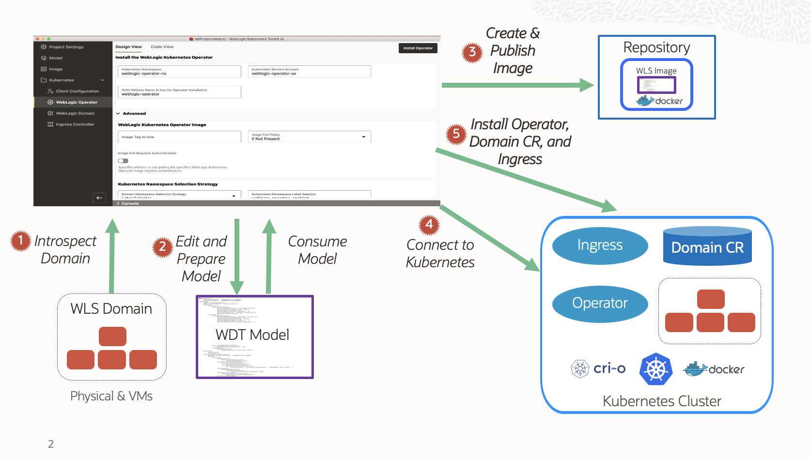

Estimated Time: 15 minutes

### Prerequisites

* You should have access to Remote Desktop

### Objectives

In this lab, you will:

* Access the WebLogic Application and show load balancing
* Show server status in WebLogic Remote Console
* Scale a WebLogic Cluster.
* Upgrade WebLogic Server version from 12.2.1.4 to 14.1.1.0


## Task 1: Access the WebLogic Application and show load balancing

1. Open Firefox browser and click the first Bookmark **Opdemo App**.
 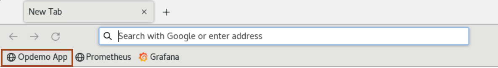
 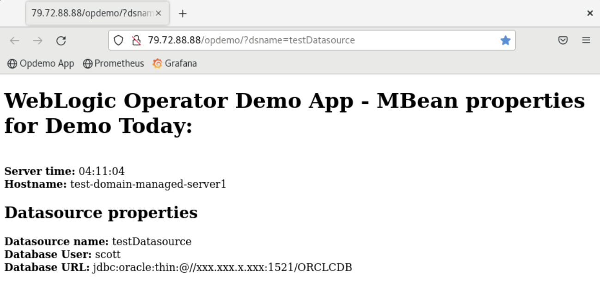

2. Click the refresh button to access the application again, and you will notice the request is served by another managed server instance. which reflects load balancing between two managed servers.
 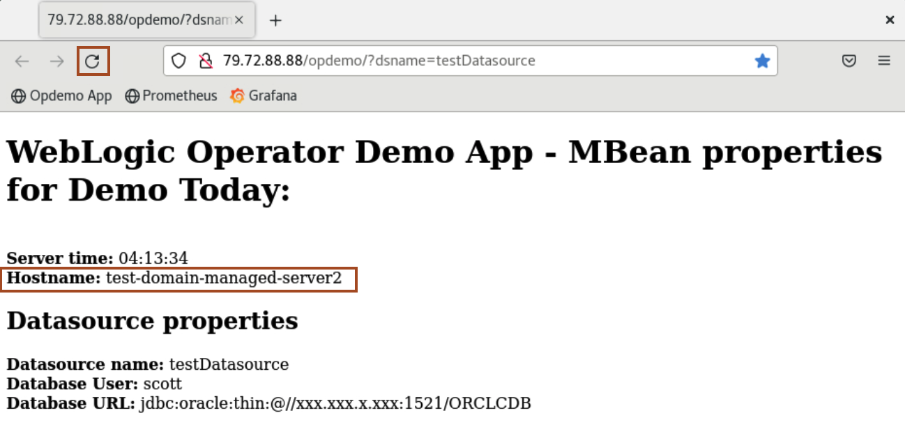

## Task 2: Show Servers status in WebLogic Remote Console

1. Click **Activities** and open the WebLogic Remote Console.

2. In the **Kiosk**, click **Settings** icon of KubeEnv as shown.
 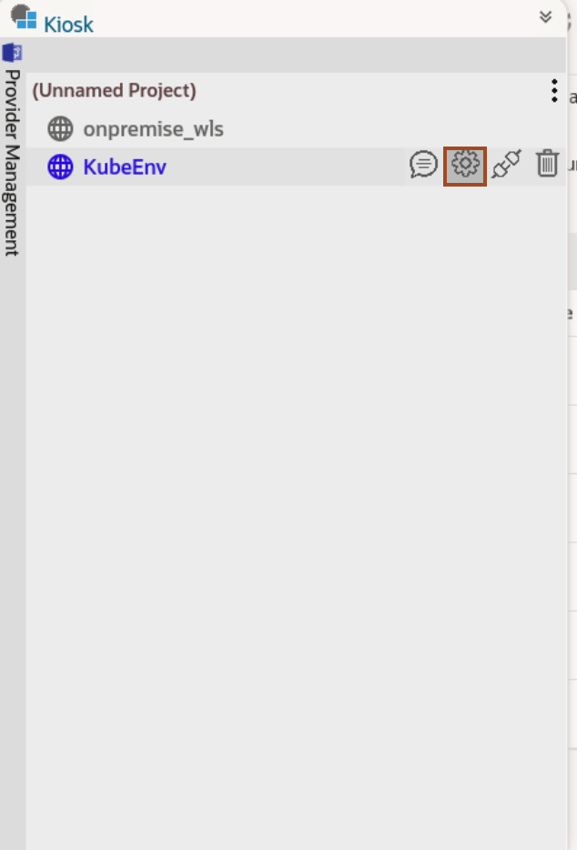

3. You should have received the password for the Admin Server. Ensure that you have values as shown in the screenshot and Click **OK**.
 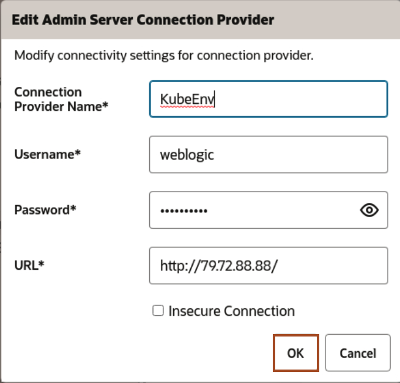

4. Click **Monitoring Icon** -> **Environment** -> **Servers**. You can view the servers in the running state.
 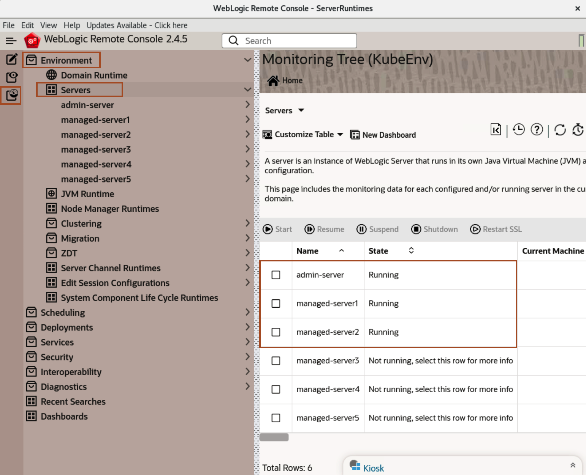

5. Click **Deployments** -> **App Deployment Runtimes** to view deployed applications.
 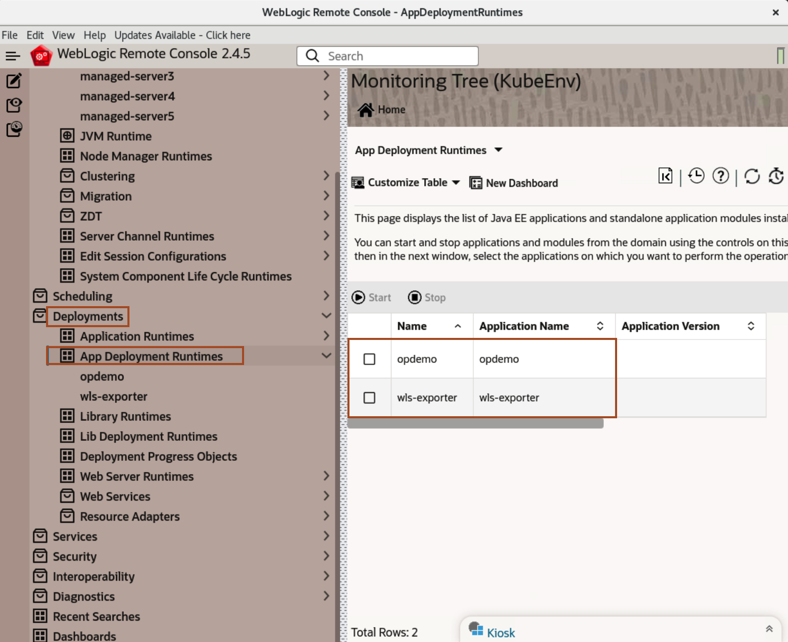

6. Click **Services** -> **Data sources** -> **JDBC Data Source Runtime MBeans** to view Application datasource.
 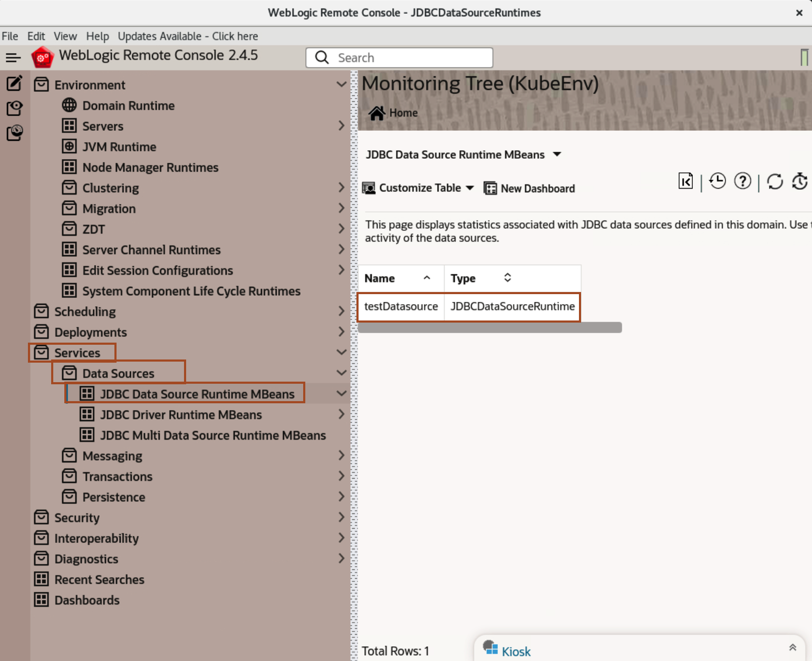

## Task 3: Scale a WebLogic Cluster

1. In WKTUI, click **Kubernetes** -> **WebLogic Domain** and then scroll down to **Clusters** section and then click **Edit** icon as shown below.
 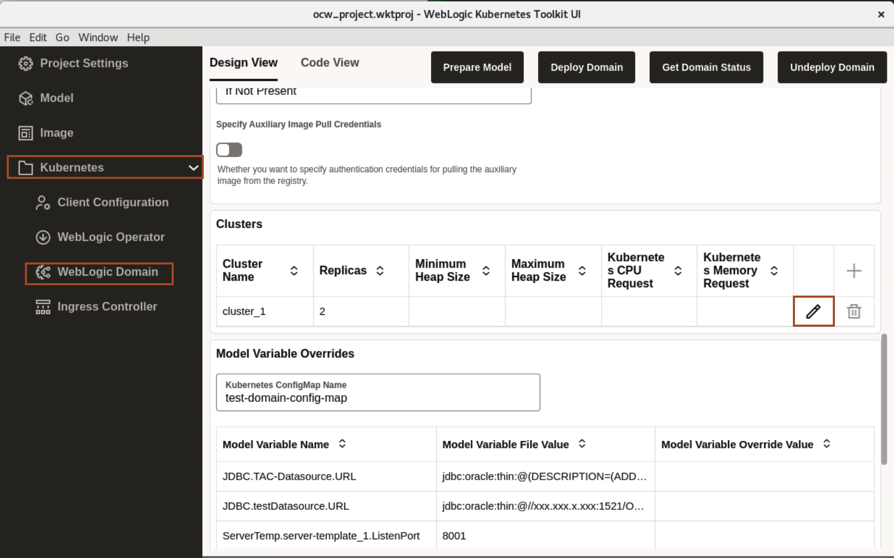

    > **Optional:** <br>
    > If you have accidentally closed the WKTUI, follow the steps below to open the WKTUI project.
    > * Click **Activities** and Open **WebLogic Kubernetes Toolkit UI**.<br>

    > * Click **File** -> **Open Project**.<br>

    > * Select **ocw_project.wktproj** from the Home folder and click **Open Project**.<br>
 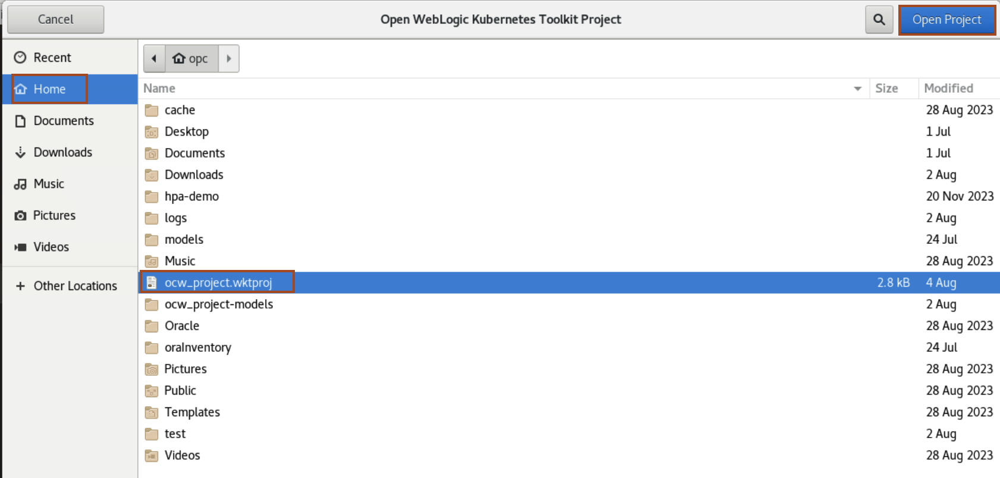


2. Change the replica from **2** to **3** and click **OK** to scale out. If the replica value is already **3** and you want to scale down, you can change the replica value from **3** to **2**.
 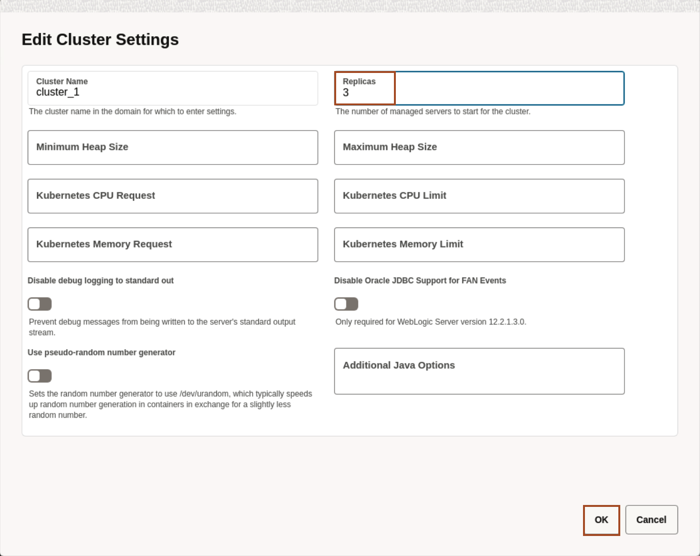

3. Click **Deploy Domain** and once it completed the process then click **Ok**.
 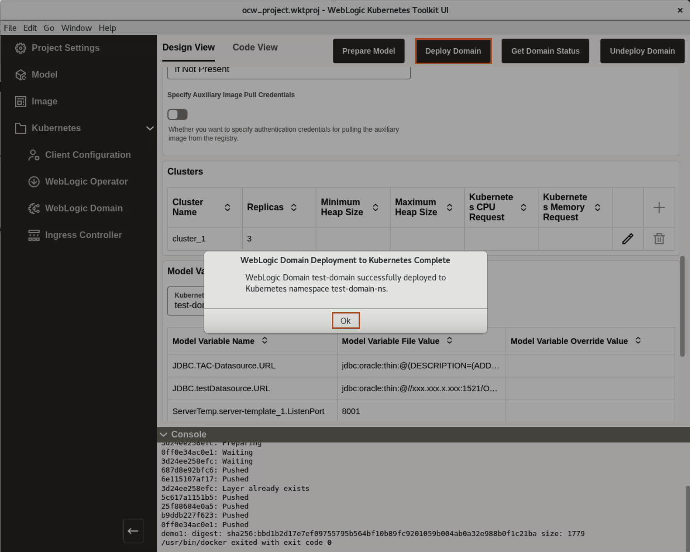

4. Go back to Terminal and Open the tab titled **Servers Pods** and copy and paste the below command to view the pods status.
 ````bash
    <copy>kubectl get pods -n test-domain-ns -w</copy>
 ````

 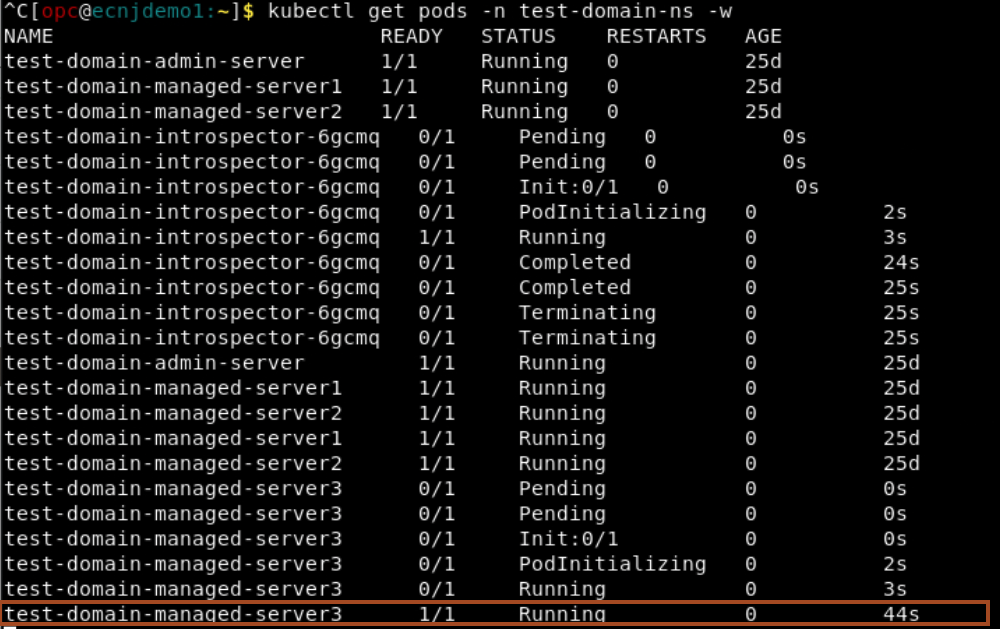

## Task 4: Upgrade WebLogic Server version from 12.2.1.4 to 14.1.1.0

1. Go back to WebLogic Kubernetes Toolkit UI, and click **WebLogic Domain**. Change the WebLogic Server Tag to **lhr.ocir.io/lrv4zdykjqrj/weblogic:14.1.1.0-slim-8-ol8** and then click **Deploy Domain**. Once Deployment is done, Click **Ok**.

 ```bash
    <copy>lhr.ocir.io/lrv4zdykjqrj/weblogic:14.1.1.0-slim-8-ol8</copy>
 ```
 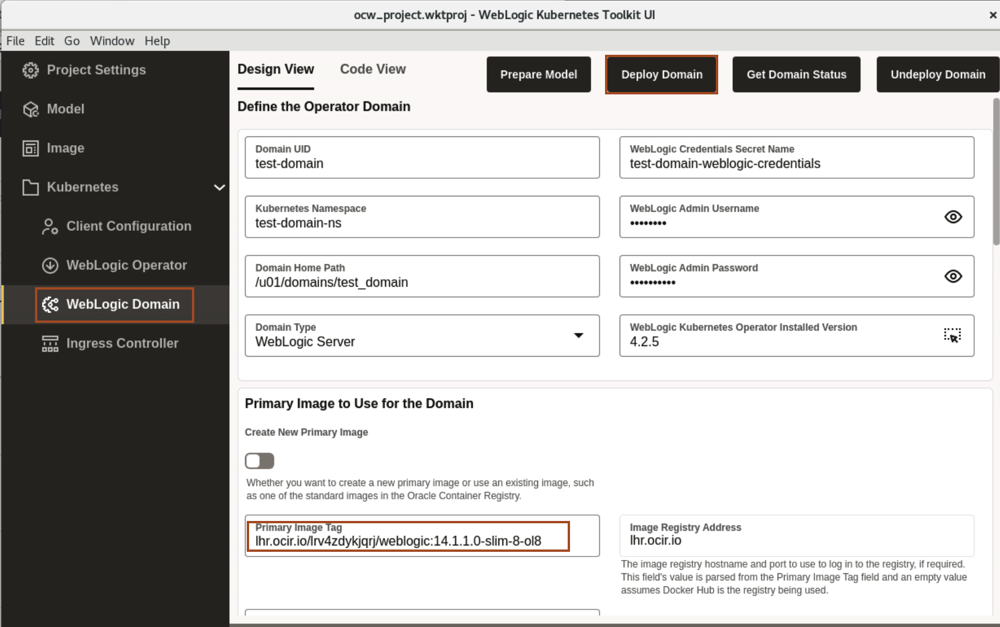

    > **Downgrade WebLogic Cluster**-<br>
    > If you already have **WebLogic 14.1.1.0** as the Primary Image, you can copy and paste the below image tag, to show downgrade WebLogic Domain. 

    > ```bash
     <copy>lhr.ocir.io/lrv4zdykjqrj/weblogic:12.2.1.4-slim-ol8</copy>
 ```

2. Go back to Terminal and Open the tab titled **Servers Pods** and copy and paste the below command to view the pods status.
 ````bash
    <copy>kubectl get pods -n test-domain-ns -w</copy>
 ````
 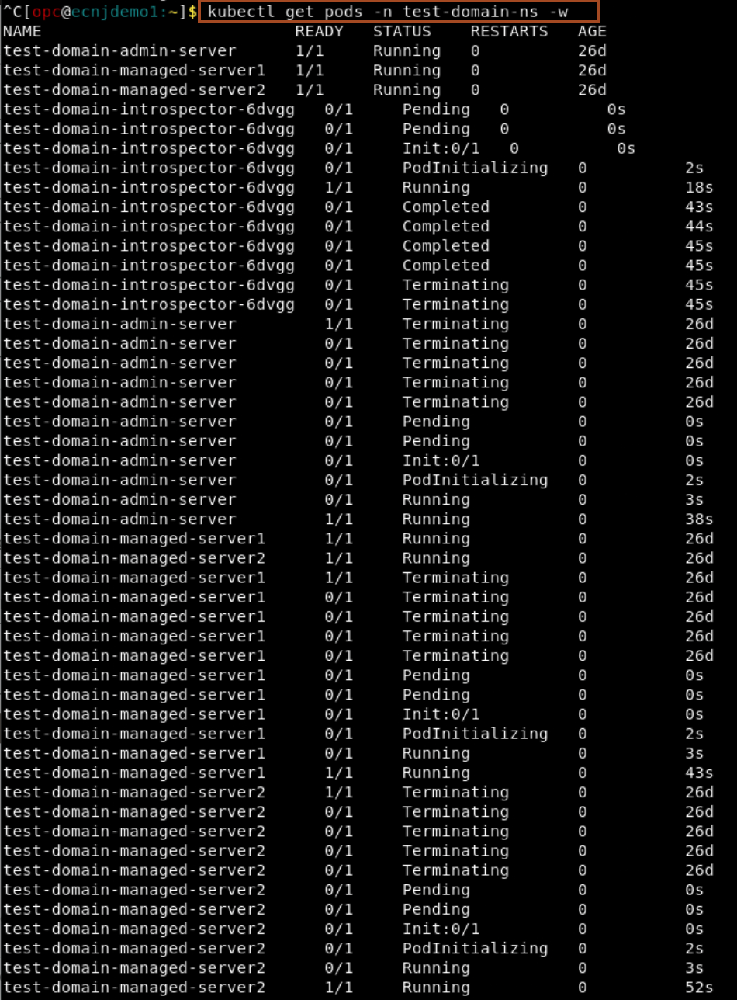

## Task 5: Clean up

1. Change the replica from **3** to **2** and click **OK** to scale in and change the WebLogic Server Tag to **lhr.ocir.io/lrv4zdykjqrj/weblogic:12.2.1.4-slim-ol8** and then click **Deploy Domain**.

    > ```bash
     <copy>lhr.ocir.io/lrv4zdykjqrj/weblogic:12.2.1.4-slim-ol8</copy>
 ```

 > It will clean the demo environment, allowing you to use it to demonstrate scaling out and upgrading the WebLogic domain. 
 

## Acknowledgements

* **Author** -  Ankit Pandey
* **Contributors** - Sid Joshi, Maciej Gruszka 
* **Last Updated By/Date** - Ankit Pandey, September 2024