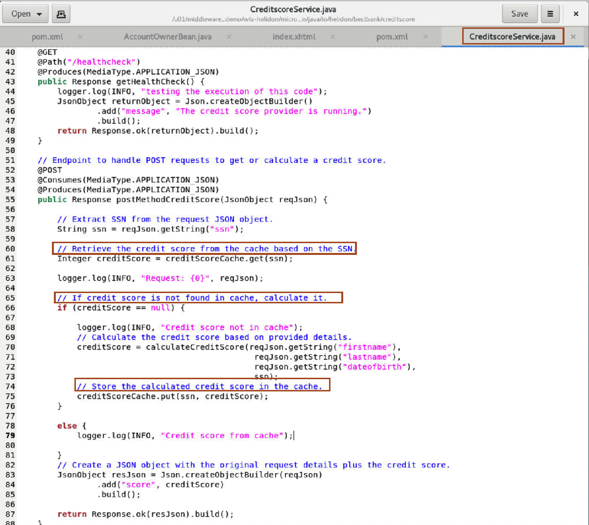

# Explore the Source code of the JAVA EE and Helidon application 

## Introduction

In this lab, we explored the steps taken to extend our application using Helidon and Coherence to enhance its functionality. We began by utilizing the Quickstart wizard to set up a Helidon MP project and integrated a new endpoint for the CreditScore service. Additionally, we used Coherence Cache for efficient credit score storage and demonstrated the corresponding updates made to the WebLogic application.

Estimated Time: 10 minutes

### Objectives

In this lab, we will review:

* Creation of Helidon MP
* Creation of CreditScore Service - Key areas of code
* Addition of Coherence CE
* Extension of WebLogic App

### Prerequisites

* Access to noVNC Remote Desktop created in lab 1.

## Task 1: Creation of Helidon MP

1. Created the project sources using Helidon MP Maven archetypes.   
 ```bash
    <copy>mvn archetype:generate -DinteractiveMode=false \
    -DarchetypeGroupId=io.helidon.archetypes \
    -DarchetypeArtifactId=helidon-quickstart-mp \
    -DarchetypeVersion=4.0.5 \
    -DgroupId=io.helidon.bestbank \
    -DartifactId=helidon-creditscore-mp \
    -Dpackage=io.helidon.bestbank.creditscore</copy>
 ```


## Task 2: Creation of CreditScore Service - Key areas of code

1. We created the **CreditScore** service, which provides the credit score of the selected customer.
 

2. We calculate the credit score based on given personal information.
 


## Task 3: Addition of Coherence CE

1. We modified the **CreditScore** service to use the Coherence cache for storing the credit score of the customer as explained in the source code.
 


2. We added dependency for coherence as explained in the source code.
 


## Task 4: Extension of WebLogic Application

For Best Bank Web Application to consume Microservice, the following changes have been made:

* Modified the User Interface. Create a View button which opens the Account Owner details window. This detail window will show the credit score value of the Account Owner.
* Modified the server side bean to invoke the Credit Score Microservices Application.
* Configured the endpoint for the Bank Web Application.

1. Modification in the User Interface.
 

2. Modification in the **Server Side Bean**.   
    - The postConstruct method was modified to read the endpoint URL from the property file.
 
    - A new getCreditScore method was created to calculate the credit score value of the Account Owner.
 
    - Finally include the new method invocation in the getSelectedAccountOwner method which is triggered by the View button on the User Interface.
 

3. Configure End-Point.
    - The Bank Web Application reads this property file to know the endpoint's URL. Obviously, this solution is just for demo purposes, because in real microservices architecture, the best practice is to use additional tools for better service/API management.
 


## Acknowledgements

* **Author** -  Ankit Pandey
* **Contributors** - Sid Joshi, Maciej Gruszka 
* **Last Updated By/Date** - Ankit Pandey, September 2024